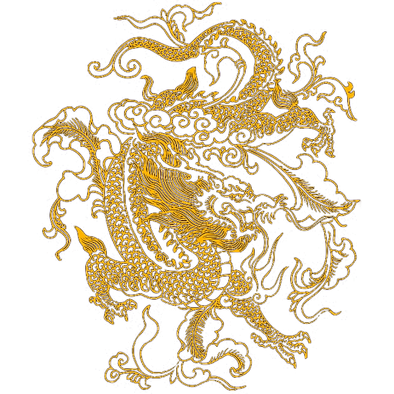

Yellow Dragon
=============

The Yellow Dragon is said to have emerged from the River Luo and be the legendary origin of the Chinese writing system.

The Yellow Dragon symbolizes wisdom, good fortune and power. Some also believe this dragon can control time and seasons.
